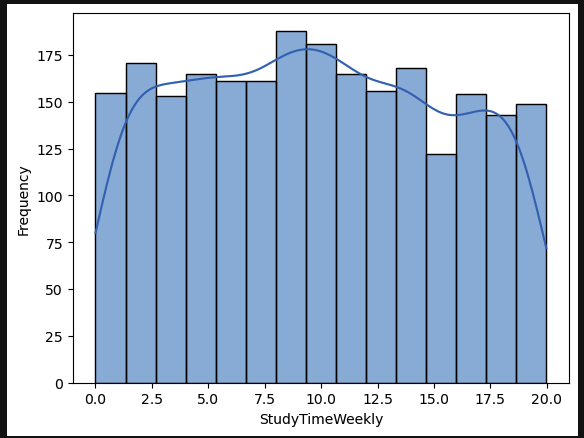
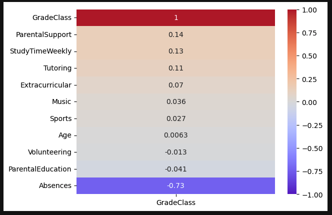
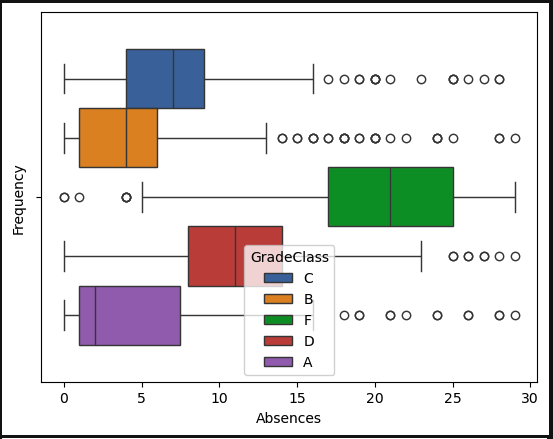

# Air Quality Project Capstone

## Overview

Welcome to my Student Permformance analysis and predictions project for my final capstone at Coding Temple! This project aims to analyze and predict the grades of over 2000 students from a dataset available on Kaggle to hopefully give casual viewers a better general understanding of what the biggest factors are in predicting a student's final grade, and the steps they could use to improve if they're not receiving the grade they thought they had earned. This project will cover various tasks involving data cleaning, exploratory data analysis (EDA) using Plotly, building predictive models using KNN, Random Forest, and Logistic Regression, with the addition of it being showcased on a Streamlit app.

## Data Dictionary

The dataset used in this project is the "Students Performance Dataset" dataset, which can be downloaded from Kaggle [here](https://www.kaggle.com/datasets/rabieelkharoua/students-performance-dataset/data)

| Column Name       | Description                                          |
|-------------------|------------------------------------------------------|
| Age               | Age of the student                                                                                |
| Gender            | Gender of the student (Male or Female)                                                            |
| Ethnicity         | Ethnicity of the student (Caucasian, African American, Asian, Other)                              |
| ParentalEducation | Education level of the parents (0: None, 1: High School, 2: Some College, 3: Bachelors, 4: Higher)|
| StudyTimeWeekly   | Weekly study time hours ranging from 0 to 20                                                      |
| Absences          | Number of absences during the year ranging from 0 to 30                                           |
| Tutoring          | Tutoring status where 0 indicuates No and 1 indicates Yes                                         |
| ParentalSupport   | The level of parental support (0: None, 1: Low, 2: Moderate, 3: High, 4: Very High)               |
| Extracurricular   | Participation in extracurricular activities with 0 indicates No and 1 indicates Yes               |
| Sports            | Participation in sports with 0 indicates No and 1 indicates Yes                                   |
| Music             | Participation in music activities with 0 indicates No and 1 indicates Yes                         |
| Volunteering      | Participation in volunteering with 0 indicates No and 1 indicates Yes                             |
| GPA               | Grade Point Average on a scale from 2.0-4.0                                                       |
| GradeClass        | Classification of student's grade |
|                   |   A: GPA >= 3.5 |
|                   |   B: 3.0 <= GPA < 3.5 |
|                   |   C: 2.5 <= GPA < 3.0|
|                   |   D: 2.0 <= GPA < 2.5|
|                   |   F: GPA < 2.0 |

## Executive Summary

### Data Cleaning Steps
- Data set had no NA values but did have numerous outliers in several columns that were dropped to have features have closest to normal distribution as possible
- Data originally contained over 2300 rows but was cut down to just over 1500 rows after removing outliers outside of a feature's IQR
- No other data cleaning was necessary afterwards as features now showed mostly normal distributions after removing outliers

### Key Visualizations

#### Feature Normality
##### Distribution of main variables such as weekly study hours are normally distributed

#### Heatmap With Features Most Correlated to GradeClass
##### Absences clearly have the biggest overall effect on a student's grade

#### Boxplot of Absences Filtered by GradeClass
##### Not suprisingly the students with the most absences have the lowest grade

## Model Performance

### Model Selection
For this analysis, we chose to try three different classification models (KNN, Logistic Regression, Random Forest) to compare the accuracy, precision, and recall of three to see which one gives us the most accurate predictions. I first made a baseline model using the ratio of regions that were labeled as "good" air quality to see if I could beat it with any of the three models. I then trained and tested all three models with both the data set before I removed the outliers and the data set after to see how much more accurate the models could get. Results are shown below.

### Evaluation Metrics

|Model (w/ Outliers)| Grade | Precision | 
|-------------------|-------|-----------|
|KNN                | F     | 0.91      |
|                   | D     | 0.34      |
|                   | C     | 0.49      |
|                   | B     | 0.31      |
|                   | A     | 0.14      |
|                   |       |           |
|Logistic Regression| F     | 0.95      |
|                   | D     | 0.45      |
|                   | C     | 0.69      |
|                   | B     | 0.52      |
|                   | A     | 0.24      |
|                   |       |           |
|Random Forest      | F     | 0.90      |
|                   | D     | 0.53      |
|                   | C     | 0.60      |
|                   | B     | 0.57      |
|                   | A     | 0.19      |                   

|Model (w/o Outliers)| Grade | Precision | 
|--------------------|-------|-----------|
|KNN                 | F     | 0.91      |
|                    | D     | 0.34      |
|                    | C     | 0.49      |
|                    | B     | 0.31      |
|                    | A     | 0.14      |
|                    |       |           |
|Logistic Regression | F     | 0.95      |
|                    | D     | 0.45      |
|                    | C     | 0.69      |
|                    | B     | 0.52      |
|                    | A     | 0.24      |
|                    |       |           |
|Random Forest       | F     | 0.90      |
|                    | D     | 0.53      |
|                    | C     | 0.60      |
|                    | B     | 0.57      |
|                    | A     | 0.19      |  

## Conclusions/Recommendations
When discussing some of the most important things your child should do in order to succeed in school, at the top of the list should be showing up every possible day that they can. As evidenced by our heatmap early on in this project, student absences can affect a students grade by almost a full point just off of one absence. While not necessarily 1-1, every class a student misses roughly affects their grade by 0.75 points. To put that into perspective, if a student were to miss just 2 classes and their GPA stood at 3.5, it could drop all the way down to a 2.0 just based on missing those classes. That's the difference between a B and a D - a huge difference. While showing up to class is very important, just being there is obviously not enough. A student's weekly study habits also have a moderately strong impact on their overall grade, as well as a parent's unconditional support. That's correct, according to the heatmap from this dataset, parental support shows a very slightly stronger impact on a student's grade than weekly study hours. Not to say a student should abandon studying altogether, but it is arguably more important for their parent to be there along every step of the student's journey to make sure they're getting their assignments done and studying before getting to do extracurricular activities/sports.

In regards to model performance, I did not expect the results to be the exact same when removing over 700 rows that contained at least 1 outlier in the row. The model beat the baseline of a 50% chance that student received an F if one were to randomly choose someone from this dataset with each model performing with over 90% accuracy in categorizing students who received an F. The other grades beat their baselines as well but did not perform well overall as a whole. The dataset was filled with half of the students getting an F giving a rather limited sample size for the remaining grades. As far as things that could improve this project, it was unfortunate that a handful of these features had to be on the binary Yes/No scale converted to 0s and 1s when they very easily could've had levels. For example, a student could be either very heavily involved in sports outside of school or have only limited exposure. That could be graded on a 0-3 scale with 0 being not active in sports, 1 is barely active, 2 is moderately active, and 3 is very active. Tweaks like that to the sports feature and the other binary features could've helped our model perform that much better instead of having them equate to yes or no. There will always be different types of student participation in hobbies and sports and having a dataset that were to reflect that more accurately would've made for a better model performance and therefore a better indicator of how well a student will perform in school.
